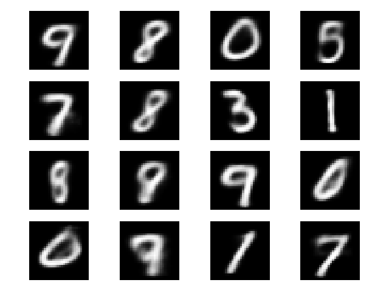
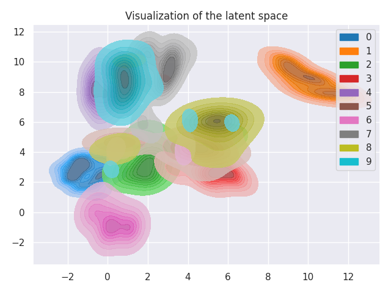

## VAE for MNIST
In this repo, I trained a small VAE model for MNIST digit generation using my own autograd framework built from scratch on top of NumPy.
For a detailed explanation, see [Auto-Encoding Variational Bayes](https://arxiv.org/abs/1312.6114).

### Results:
Digits sampled from the Gaussian distribution:


Visualization of the latent space:


### Usage:
To run the code:

```{bash}
pip install -r requirements.txt
python train.py
```